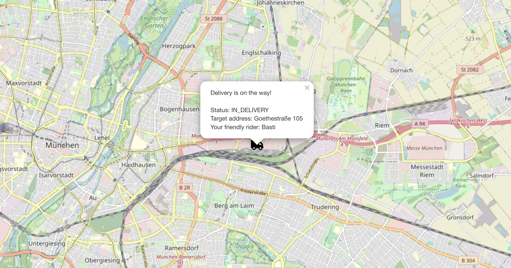
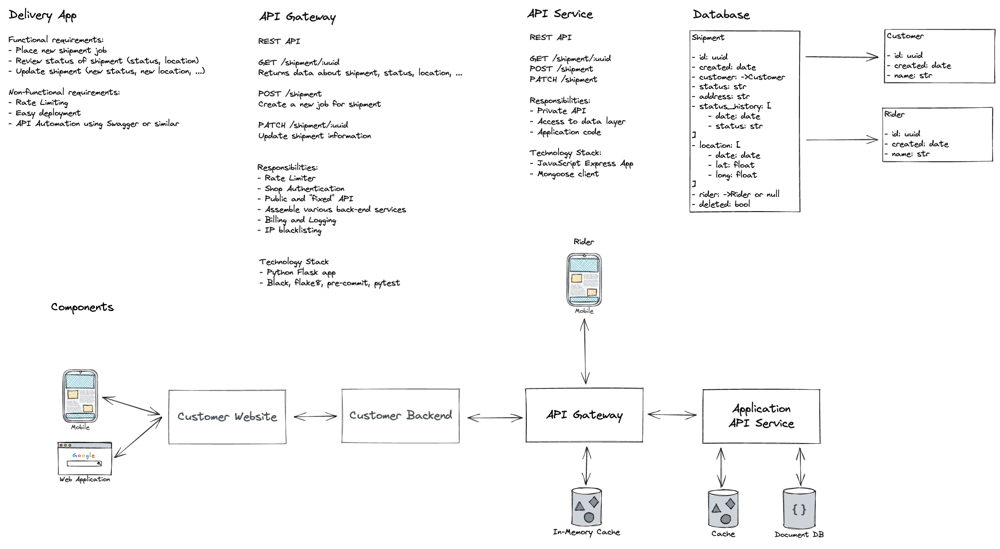

# Showcase "Delivery App"



This small app showcases various components in a typical web project. It includes
- React frontend using `leaflet-react` to display a map
- Python API gateway for rate limiting, CORS, authentification (todo) and public API
- JavaScript API service for the internal business logic and to access the persistence layer
- MongoDB Storage

In specific, it can create "shipment" jobs and update the current location of the parcel by the rider, see screenshot above.

The goal of the project is to have a small play ground to test various 3rd party components (e.g. `flask-limiter`), tools or concepts. 

## Running the App

1. Start all services for frontend and backend

```
docker-compose up --build
```

2. Create a new shipment job using postman or curl
```bash
curl --location --request POST 'http://127.0.0.1:3000/shipment' \
--header 'Content-Type: application/json' \
--data-raw '{
    "address": "Goethestraße 105",
    "customer": "2387647b-9c4f-4694-9498-cd19832e7cfb"
}'
```

3. Visit http://127.0.0.1:3002/?track=$shipment_id with the correct shipment ID

4. Because the shipment is not being delivered yet, we don't see it on the map. Change the status and the current location
```bash
curl --location --request PATCH 'http://127.0.0.1:3000/shipment/$shipment_id' \
--header 'Content-Type: application/json' \
--data-raw '{
    "status": "IN_DELIVERY",
    "location": {
        "lat": 48.137154,
        "long": 11.64124
    },
    "rider": "Basti"
}'
```

5. Every time you send a PATCH request, the marker should update shortly afterwards


## Current Architecture



## Todos

- [ ] Add and configure Uptime-Kuma for health monitoring
- [ ] Proper authentification
- [ ] Admin interface with Flask-SQLAlchemy?
- [ ] Github Actions code checks
- [ ] Tracking, billing, analytics, ...